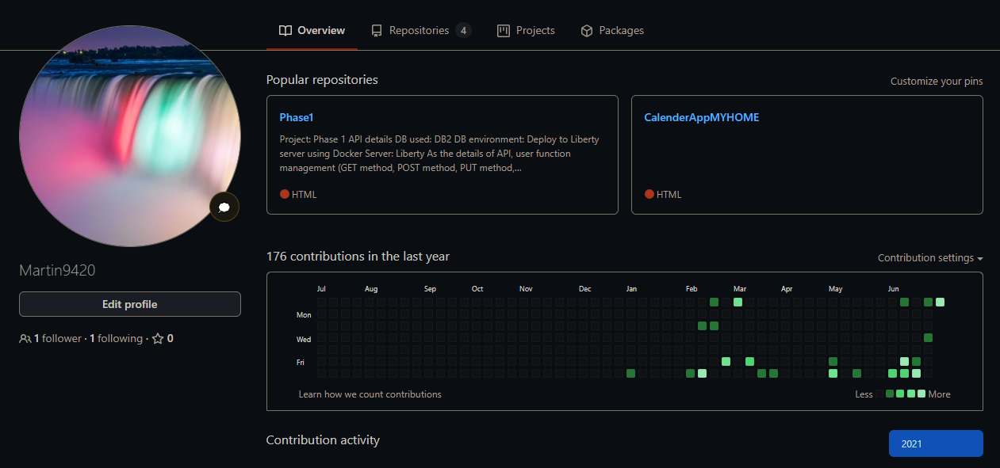
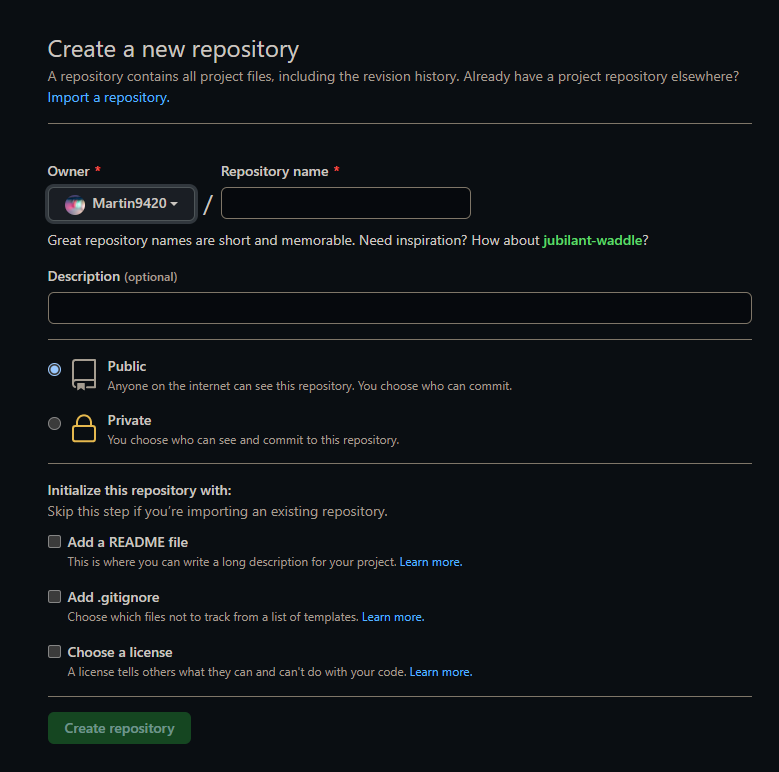
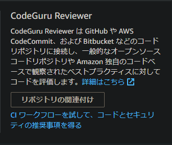
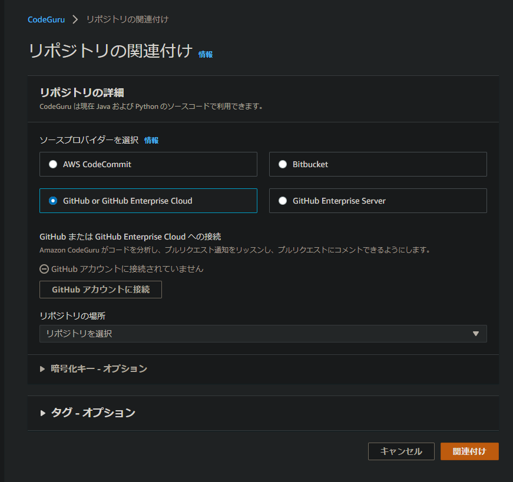
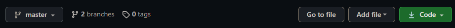
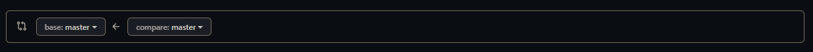

== AWS CodeGuru利用ガイド
=== ガイド対象
* GitHubの環境構築
    - コードレビューの前準備
* AWS CodeGuru Reviewer
    - コードレビュー機能

== GitHubへのコードレビュー用リポジトリの作成
１：GitHubへログインし、ログインアカウントへ移動します。 +
 +
２：画面上部の「Repositories」を選択します。 +
３：選択後、リポジトリの一覧画面へ遷移するので、画面右上のNewボタンで新規リポジトリを作成します。 +
４：リポジトリ作成の為の詳細設定画面に遷移するので、必要項目を入力し、Create Repositoryを押下しリポジトリを作成し、終了となります。 +
 +
== AWS CodeGuru Reviewerの環境構築
１：AWS Management Consoleにアクセスし、「AWS CodeGuru」と検索をし、AWS CodeGuruアプリケーションを探します。 +
２：検索完了後、AWS CodeGuruのどの機能を使うかの選択画面に遷移するので、利用したいレビュー機能を選択します。＊まずは、AWS CodeGuru Reviewerの「リポジトリの関連付け」を選択してください。 +
 +
３：選択後、GitHubへのリポジトリ関連付けの設定画面に移るので、以下の手順でGitHubリポジトリトAWS CodeGuruを関連付けます。 +
・ソースプロバイダーを選択 → GitHub or GitHub Enterprise Cloud +
・GitHubまたはGitHub Enterprise Cloudへの接続 → 自身のGitHubアカウントへログインし関連付けを行う。 +
・リポジトリの場所 → ソースコードを配置するリポジトリを選択 +
 +
４：以上でGitHubへの連携は終了なので、関連付けボタンを選択し終了です。 +
== AWS CodeGuru Reviewerによるコードレビューの実施
１：先程、関連付けたリポジトリに移動します。 +
２：対象リポジトリへ画面遷移後、デフォルトでは「masterブランチ」となっているので、このmasterブランチに対してプルリクエストを行うためにブランチをもう一つ作成します。 +
 +
３：ブランチ作成後、ソースコードを同一の（作成したブランチに）配置します。 +
４：配置後、画面上部のメニュータブデ、Pull requestsを選択しプルリクエスト画面へ遷移します。 +
５：画面遷移後、New pull requestボタンがあるので、選択します。 +
６：遷移後、プルリクエスト画面に遷移するので、以下の手順でリクエスト元也リクエスト先を選択し、プルリクエストを作成します。 +
・base:master +
・compare:ソースコードを配置しているブランチ +
 +
以上で、プルリクエスト内容は設定完了ですので、Create pull requestでリクエストを確立してください。 +
*AWS CodeGuruからのレビューにかかる時間は、大体15分程度になります。 +
