== SkyWayアプリケーション作成初期環境構築ガイド
=== 構築対象環境
* IDE
    - Eclipse
* フロントアプリケーション開発ツール
    - VSCode
* DB
    - PostgreSQL
* PostgreSQL動作環境
    - Docker コンテナ（Comming Soon)
* Web Application Server（Comming Soon)
    - WildFly

== Eclipseの環境構築方法
本プロジェクトでは、Eclipse2020-06を利用しています。 +
Eclipseを利用するにあたり環境構築を以下の手順で行ってください。 +
１：下記リンク先にアクセスし、Javaの環境変数登録用のJDKをインストールしてください。
https://www.oracle.com/java/technologies/javase/javase-jdk8-downloads.html +
.JDKのインストールについて
NOTE: Java SE8をダウンロードしてください。 +
２：ダウンロード完了後、インストーラーを実行し、JDKを適当なディレクトリに配置します。 +
３：次に、インストールしたJDKを環境変数のパスに通す作業に移ります。 +
４：Windowsの検索ボックスで「コントロールパネル」を検索してください。 +
５：コントロールパネルを開き、システムを選択 +
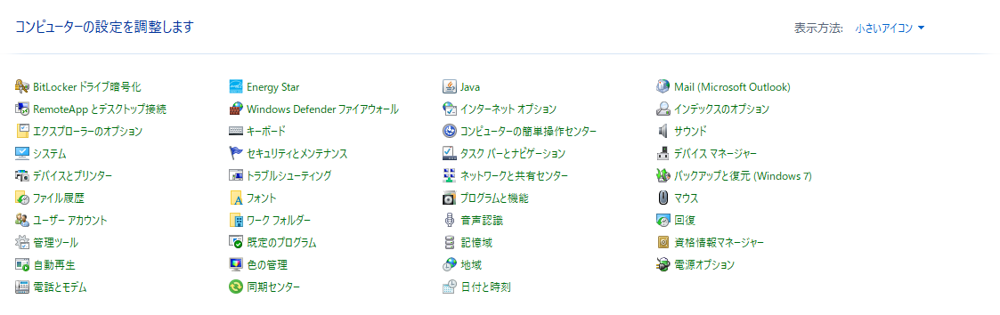 +
６：システムを選択後、Windows標準の詳細情報ウィンドウが開くので、右上にある「システムの詳細設定」を選択。 +
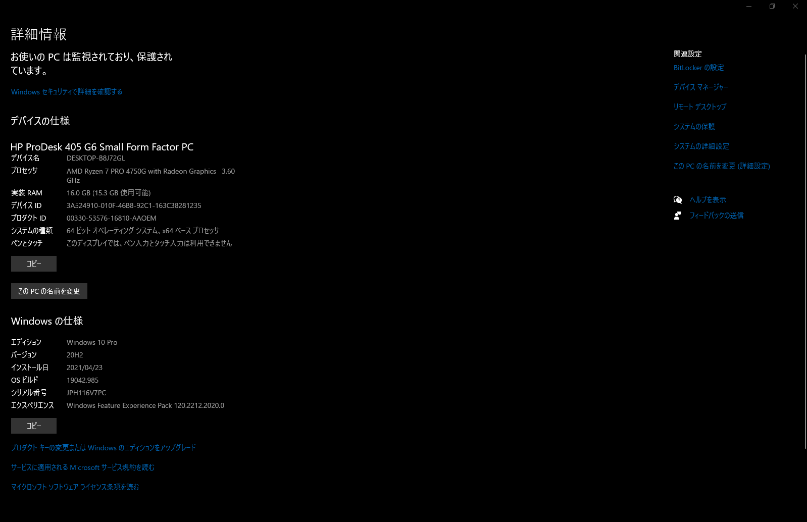 +
７：システムのプロパティウィンドウが開くので、「環境変数」を選択。 +
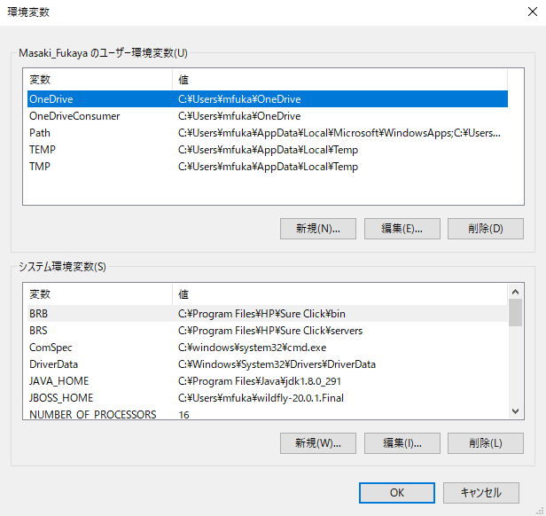 +
８：システムの環境変数の「新規」を選択し、新しいシステム変数ウィンドウが開くので、先ほどインストールしたJDKの”bin”フォルダまでのパスを以下のように設定。 +
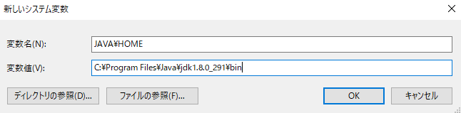 +
９：JAVA_HOMEの設定が完了後、同じシステム環境変数の中の「Path」を選択し、新規ボタンを選択。 +
１０：その後、先ほどのJDKのフォルダパスを新規で追加し、その追加したパスをリストの一番上部に配置し、環境変数へのJAVA_HOMEの設定は終了です。 +
最後に、環境変数にパスがちゃんと登録されているか確認をしてみましょう。 +
Windowsの検索ボックスに「cmd」と入力してください。 +
すると、コマンドプロンプトが立ち上がるので、以下のコマンドを実行してください。 +
>java -version +
以下のレスポンスが来たらしっかりとJAVA_HOMEの環境変数のパスが通っています。 +
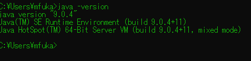 +

== Eclipseのインストール方法
１：以下リンクにてEclipseのインストーラーをダウンロードしてください。 +
https://www.eclipse.org/downloads/packages/release/2020-06 +
２：リンクにアクセス後、以下の画面に遷移するので、「R Package」を選択。 +
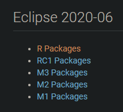 +
３：「R Package」を選択し、以下の画面に遷移するので、「Eclipse IDE for Enterprise Java Developers」の「Windows x86_64」を選択。 +

.開発環境について
NOTE: この画面では、お使いのPCのOSを確認しインストールを行ってください。 ＊Windows：「Windows x86_64」Mac：「macOS x86_64」Linux：「Linux x86_64」 +
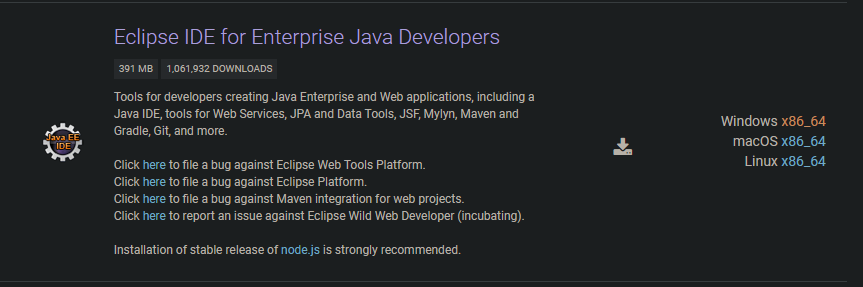 +
４：上記メニューを選択後、以下の画面に遷移するので、画面中央のDownloadを押下し、インストーラーをダウンロードし、完了後にインストーラを使い「Eclipse」を取得してください。
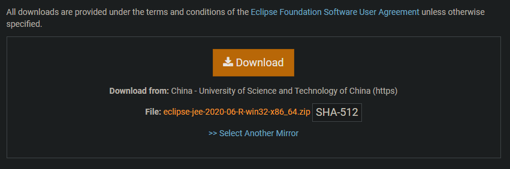 +
以上で、Eclipseの環境構築及びIDEのインストールは完了です。 +

== VSCodeのインストール方法（必要に応じて）
ここでは、VSCodeのインストール方法、及び推奨されるプラグインの紹介を行います。必要に応じてインストール及びプラグインの導入を行ってください。 +
１：VSCodeのインストールを行うため、下記リンクにアクセスをしインストーラーをダウンロードしてください。 +
https://azure.microsoft.com/ja-jp/products/visual-studio-code/ +
２：インストーラをダウンロード後、ガイドに従いVSCodeをインストールしてください。

=== VSCodeの推奨プラグインの導入について
以下に、フロントアプリを開発するにあたり必要なプラグインを紹介します。必要に応じてプラグインの導入をお願いいたします。 +

* Auto Rename Tag +
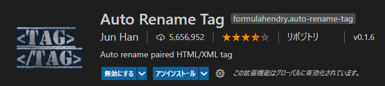 +
* CSSTree validator +
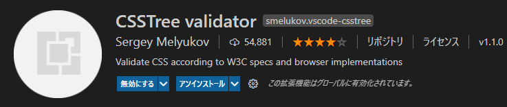 +
* HTML CSS Support +
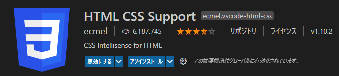 +
* HTMLHint +
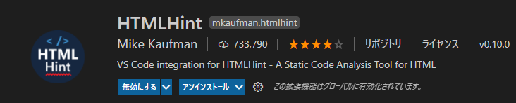 +
* IntelliSense for CSS class names in HTML +
image:IntelliSenseforCSSclassnamesinHTML.PMG[] +
* Japanese Language Pack forVisual Studio Code +
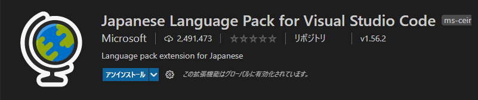 +
* javascript console utils +
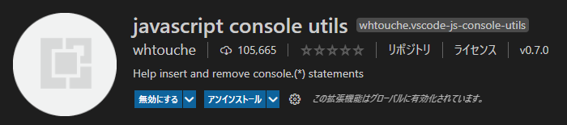 +
* Live HTML Previewer +
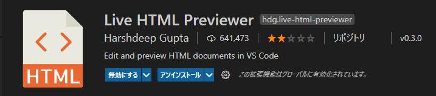 +
* Live Server +
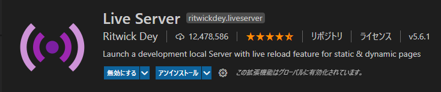 +
* Live Share +
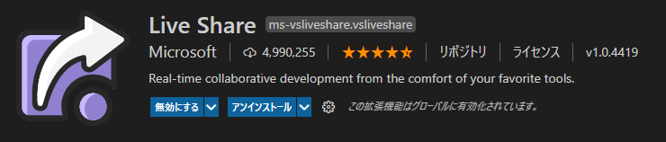 +
* REST Client +
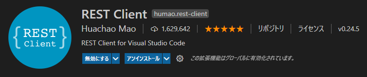 +
* Visual Studio IntelliCode +
 +
* zenkaku +
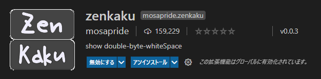 +
以上が、フロントアプリケーションを開発する際の推奨プラグインとなります。また、状況によりプラグインを別途インストールする必要がありますので、ご注意ください。 +

== DB(PostgreSQL)の環境構築方法
今回、DBはDocker上のコンテナとして動作をさせます。 +
もし、Dockerのインストールがまだの方は、「Dockerのインストール手順」を先に行い、その後PostgreSQLコンテナの環境構築をお願いいたします。 +
１：まず、Dockerコンテナイメージの取得をDocker Hubから行います。 +
以下のコマンドをコマンドプロンプトで実行してください。 +
>docker pull postgres +
２：その後、以下コマンドを実行すると、イメージが取得できたことを確認できます。 +
>docker images +
３：以下のコマンドを実行し、取得したDockerイメージから、コンテナのプロセスを実行します。 +
>docker run –name test_postgres -e POSTGRES_PASSWORD=test-pass -d -p 15432:5432 postgres +

.コマンドの説明
NOTE: １： -name test-postgres +
-nameオプションでtest_postgresというコンテナ名を指定しています。これを指定することで、コンテナを指定した名前で参照することができます。 +
２：-e POSTGRES_PASSWORD=test-pass +
-eオプションで環境変数を追加することができます。
ユーザー名とデータベース名は何も指定しなくてもpostgresが初期値として設定されています。 +
postgresのDockerイメージからコンテナを動かすためには、最低限パスワードPOSTGRES_PASSWORDを指定する必要があります。 +
３：-d +
「デタッチド・モード」すなわちコンテナをバックグラウンドで起動するオプションです。 +
４：-p 15432:5432 +
-pオプションは外部のポートとコンテナ内部のポートを接続するオプションです。 +
-p 15432:5432はローカルの15432ポートにアクセスすると、dockerコンテナ内部の5432ポートで動いているアプリケーションに接続できるようになります。 +
５：postgres +
dockerイメージを指定しています。 +

４：プロセスの確認 +
以下のコマンドを実行することで起動中のプロセスを確認することができます。 +
>docker ps +
実行すると、以下のように表示されます。 +
CONTAINER ID IMAGE COMMAND CREATED STATUS PORTS NAMES
fa07e2716e4d postgres “docker-entrypoint.s…” 10 seconds ago Up 9 seconds 0.0.0.0:15432->5432/tcp test_postgres +
５PostgreSQLにアクセスする。 +
以下リンクにアクセスし、PostgreSQLの環境をローカルで確認できるようにします。 +
https://www.postgresql.org/download/ +
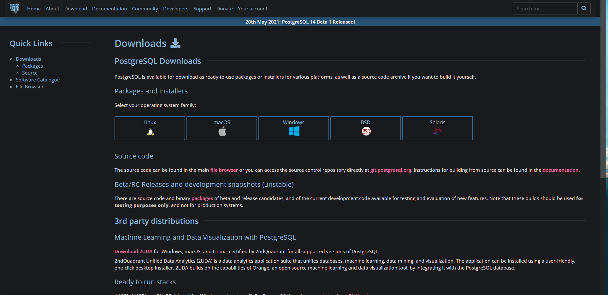 +
インストーラーをダウンロードするために利用PCのOSにあった項目を選択し、PostgreSQLのインストーラーをダウンロードしてください。 +
６：以下の画面に遷移後、「Download the installer」を選択してください。 +
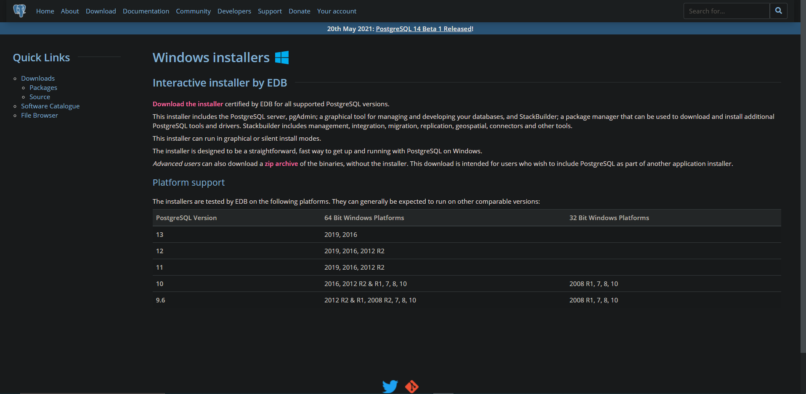 +
７：インストーラーのダウンロードが完了後、インストーラーを起動しPostgreSQLのアプリケーションをインストールしてください。 +
８：アプリケーションインストール完了後、pgAdmin4を実行し、PostgreSQLのローカルインストールは完了です。 +
＊DBのテーブル作成については別途記載します。 +

